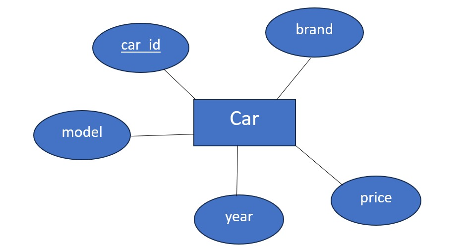
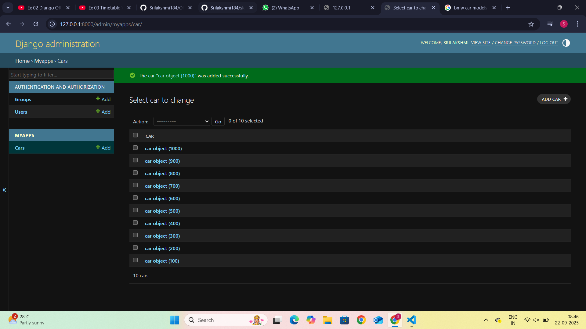
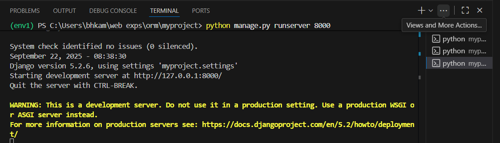

# Ex02 Django ORM Web Application
## Date: 22/09/2025

## AIM
To develop a Django application to store and retrieve data from Car Inventory Database using Object Relational Mapping(ORM).

## ENTITY RELATIONSHIP DIAGRAM




## DESIGN STEPS

### STEP 1:
Clone the problem from GitHub

### STEP 2:
Create a new app in Django project

### STEP 3:
Enter the code for admin.py and models.py

### STEP 4:
Execute Django admin and create details for 10 books

## PROGRAM
```
admin.py

from django.contrib import admin
from . models import car

admin.site.register(car)

class carAdmin(admin.ModelAdmin):
    list_display = ('car_id','brand','model','price','year')


models.py

from django.db import models

# Create your models here.
class car(models.Model):
    car_id = models.IntegerField(primary_key=True)
    brand = models.CharField(max_length=50)
    model = models.CharField(max_length=50)
    price = models.IntegerField()
    year = models.DateField()

```


## OUTPUT






## RESULT
Thus the program for creating a database using ORM hass been executed successfully
